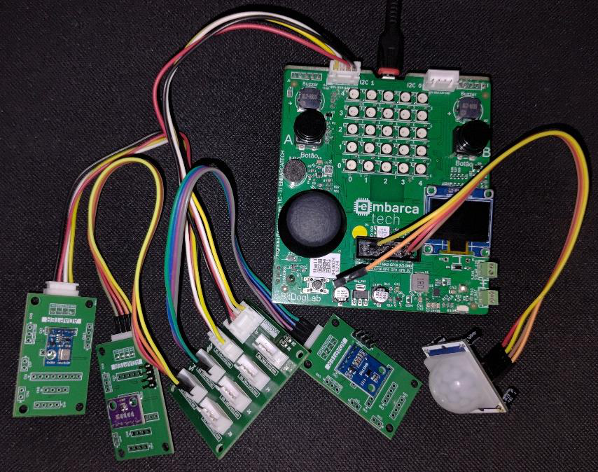
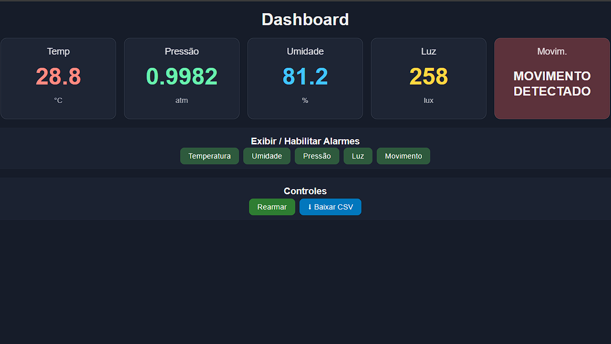
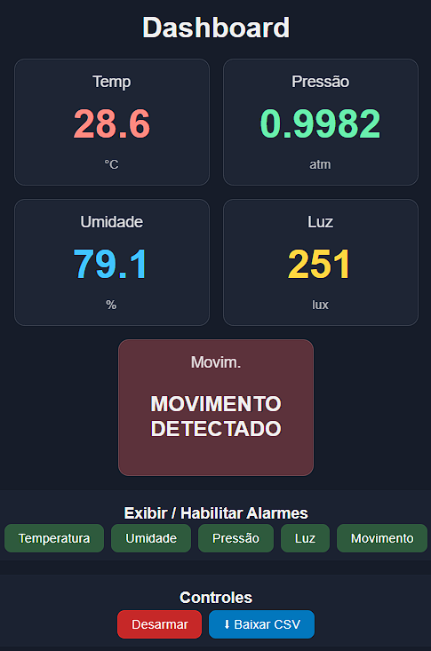
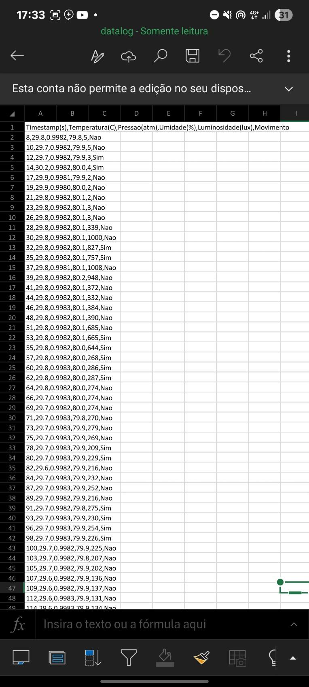

# Plataforma Modular para Monitoramento Laboratorial

Sistema embarcado de baixo custo para monitoramento ambiental em ambientes laboratoriais, desenvolvido com **Raspberry Pi Pico W**, sensores ambientais e interface web embarcada.

O projeto permite acompanhar, em tempo real, variáveis como **temperatura**, **umidade**, **pressão atmosférica**, **luminosidade** e **movimento**, além de fornecer alarmes audiovisuais e exportação dos dados coletados em formato CSV.

---

## Visão Geral

A **Plataforma Modular para Monitoramento Laboratorial** foi desenvolvida como projeto final da primeira etapa do curso **EMBARCATECH**, no Instituto Federal de Educação, Ciência e Tecnologia do Maranhão - Campus Monte Castelo.

A proposta do sistema é oferecer uma alternativa acessível, modular e de código aberto para monitoramento contínuo de ambientes críticos, como laboratórios, salas técnicas, estufas, ambientes de pesquisa e locais que demandam acompanhamento ambiental periódico.

Soluções comerciais de monitoramento podem apresentar alto custo e baixa flexibilidade. Este projeto busca resolver esse problema por meio de uma plataforma baseada em **Internet das Coisas (IoT)**, utilizando componentes acessíveis e firmware desenvolvido em linguagem C.

---

## Objetivo

Desenvolver uma plataforma de monitoramento ambiental laboratorial de baixo custo, modular e interativa, baseada no microcontrolador **Raspberry Pi Pico W**, integrada à placa **BitDogLab**.

---

## Funcionalidades

- Monitoramento em tempo real via navegador web.
- Leitura de temperatura.
- Leitura de umidade relativa do ar.
- Leitura de pressão atmosférica.
- Leitura de luminosidade em lux.
- Detecção de movimento por sensor PIR.
- Dashboard web responsivo.
- Servidor web embarcado no próprio microcontrolador.
- Sistema de alarmes com prioridade.
- Alarme sonoro por buzzer.
- Alarme visual por LED RGB.
- Habilitação e desabilitação seletiva de sensores pela interface.
- Botão para armar e desarmar alarmes.
- Registro histórico das medições em memória.
- Exportação dos dados em arquivo CSV.
- Arquitetura de firmware não-bloqueante.

---

## Tecnologias Utilizadas

- Linguagem C
- Raspberry Pi Pico SDK
- Raspberry Pi Pico W
- BitDogLab
- lwIP
- Wi-Fi embarcado
- HTML
- CSS
- Servidor HTTP embarcado
- Comunicação I2C
- PWM
- GPIO

---

## Componentes de Hardware

| Componente | Função |
|---|---|
| Raspberry Pi Pico W | Microcontrolador principal com conectividade Wi-Fi |
| BitDogLab | Placa de apoio utilizada no projeto |
| BMP280 | Sensor de temperatura e pressão atmosférica |
| AHT10 | Sensor de umidade e temperatura |
| BH1750 | Sensor de luminosidade |
| PIR HC-SR501 | Sensor de movimento |
| LED RGB | Sinalização visual dos alarmes |
| Buzzer passivo | Sinalização sonora dos alarmes |
| Jumpers | Conexões entre sensores e placa |
| Extensor I2C | Expansão e conexão dos sensores no barramento I2C |

---

## Imagens do Projeto

### Montagem do Hardware



### Dashboard Web



### Dashboard Responsivo


### Funcionalidades da Interface



### Exportação de Dados em CSV



---

## Arquitetura do Sistema

O sistema foi estruturado em três camadas principais:

### 1. Camada de Sensores

Responsável pela coleta dos dados ambientais. Os sensores **BMP280**, **AHT10** e **BH1750** são conectados ao barramento **I2C**, enquanto o sensor **PIR HC-SR501** é conectado a uma entrada digital GPIO.

### 2. Camada de Processamento

Executada no **Raspberry Pi Pico W**. O firmware realiza a leitura dos sensores, processa os dados, avalia os alarmes, atualiza o estado geral do sistema e gerencia a comunicação com a interface web.

### 3. Camada de Interface

Fornecida por um servidor web embarcado. O usuário acessa o dashboard pelo navegador utilizando o endereço IP gerado pelo Pico W na rede local.

---

## Sensores Monitorados

### Temperatura

A temperatura é monitorada por sensores digitais integrados ao sistema. Essa medição permite identificar desvios ambientais que possam comprometer experimentos, equipamentos ou materiais sensíveis.

### Umidade

A umidade relativa do ar é monitorada pelo sensor **AHT10**. O sistema pode gerar alertas quando a umidade ultrapassa os limites definidos no firmware.

### Pressão Atmosférica

A pressão é medida pelo sensor **BMP280**, permitindo acompanhar variações ambientais e tendências relacionadas ao ambiente monitorado.

### Luminosidade

A luminosidade é medida pelo sensor **BH1750**, que fornece os valores diretamente em lux.

### Movimento

A presença ou movimentação é detectada pelo sensor **PIR HC-SR501**. Quando há movimento, o sistema pode acionar um alerta prioritário.

---

## Sistema de Alarmes

O projeto possui um sistema de alarmes audiovisuais com lógica de prioridade.

A prioridade dos alarmes segue a seguinte ordem:

1. Detecção de movimento.
2. Violação de temperatura.
3. Violação de umidade.

Quando o sensor PIR detecta movimento e o alarme geral está armado, o sistema aciona o buzzer e o LED RGB com prioridade máxima.

Quando não há movimento, o sistema verifica os limites de temperatura e umidade. Caso algum limite seja ultrapassado, o alerta correspondente é ativado.

---

## Dashboard Web

O dashboard é acessado por navegador web, desde que o dispositivo esteja conectado à mesma rede local do Raspberry Pi Pico W.

A interface apresenta os dados em tempo real por meio de cards, exibindo:

- Temperatura
- Pressão atmosférica
- Umidade
- Luminosidade
- Estado de movimento

Também é possível controlar algumas funcionalidades diretamente pela interface, como:

- Exibir ou ocultar sensores.
- Habilitar ou desabilitar alarmes relacionados aos sensores.
- Armar ou desarmar o alarme geral.
- Baixar o histórico de medições em CSV.

---

## Exportação de Dados

O sistema registra as medições mais recentes em um buffer circular na memória do microcontrolador.

Ao clicar no botão **Baixar CSV**, o navegador realiza o download de um arquivo chamado:

```text
datalog.csv
```

O arquivo contém os dados organizados em colunas, como:

```text
Timestamp, Temperatura, Pressão, Umidade, Luminosidade, Movimento
```

Esse recurso permite analisar posteriormente o comportamento ambiental em ferramentas como Excel, LibreOffice Calc, Google Planilhas ou softwares de análise de dados.

---

## Rotas HTTP Utilizadas

| Rota | Função |
|---|---|
| `/` | Exibe o dashboard principal |
| `/toggle-alarm` | Alterna o estado do alarme geral |
| `/toggle-vis` | Alterna a visibilidade e habilitação dos sensores |
| `/download` | Realiza o download do arquivo CSV |

---

## Resultados Obtidos

O sistema demonstrou funcionamento estável, com leitura periódica dos sensores, exibição dos dados em tempo real e resposta rápida aos comandos do usuário.

Durante os testes, o dashboard apresentou os dados ambientais de forma clara e responsiva, funcionando também em dispositivos móveis. O sistema de alarmes atuou corretamente conforme a lógica de prioridade definida, e a exportação dos dados em CSV foi validada com sucesso.

---

## Possíveis Melhorias Futuras

- Persistência dos dados em cartão SD.
- Armazenamento em memória flash.
- Integração com banco de dados.
- Integração com plataformas em nuvem.
- Acesso remoto fora da rede local.
- Envio de notificações por e-mail.
- Envio de alertas por aplicativos de mensagens.
- Integração com relés para controle automático de climatização.
- Implementação de autenticação no dashboard.
- Criação de gráficos históricos na interface web.
- Uso de MQTT para comunicação com plataformas IoT.

---

## Aplicações Possíveis

- Laboratórios de pesquisa.
- Salas de servidores.
- Estufas.
- Ambientes industriais.
- Ambientes acadêmicos.
- Monitoramento ambiental residencial.
- Projetos educacionais de IoT.
- Sistemas de baixo custo para rastreabilidade ambiental.

---

## Autor

**José Ribamar Cerqueira Muniz**

Projeto desenvolvido no âmbito do curso **EMBARCATECH**, no Instituto Federal de Educação, Ciência e Tecnologia do Maranhão - Campus Monte Castelo.

## Status do Projeto

Projeto funcional e validado em ambiente de testes.
